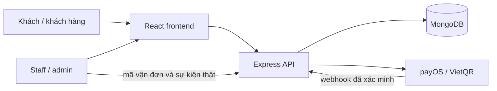

# Kiến trúc Hà Thành Vị

Repository npm workspaces với frontend và backend độc lập. TypeScript kiểm tra hợp đồng trong từng phần. HTTP JSON nối trình duyệt với API; backend sở hữu giá, quyền truy cập, trạng thái đơn và xác nhận thanh toán.

## Frontend

`app` ghép provider; `routes` khai báo trang; `layouts` chứa header/footer; `pages` chứa màn hình theo nghiệp vụ; `components` là phần giao diện dùng lại. `contexts` giữ giỏ và nội dung, `hooks` truy cập state, `services` gọi API, `constants` định nghĩa dữ liệu/kiểu, `utils` định dạng tiền và khóa tra cứu, `styles` chứa thiết kế chung. `assets` đăng ký tài nguyên; ảnh/font tĩnh ở `public/brand` để dùng URL ổn định khi cập nhật CMS.

Giỏ hàng lưu cục bộ, không chứa thông tin thanh toán. Khóa đơn guest giữ trong sessionStorage và chỉ gửi qua header. Tài khoản dùng phiên cookie HttpOnly. Nội dung gói kèm giúp preview hoạt động khi API chưa sẵn sàng; việc đặt đơn luôn phụ thuộc backend thật.

## Backend

`routes` ghép endpoint/middleware; `controllers` kiểm tra request và trả response; `services` xử lý nghiệp vụ/repository; `models` lưu MongoDB; `validators` kiểm tra dữ liệu; `middlewares` phân quyền, phiên và lỗi; `config` đọc môi trường/kết nối; `constants` định nghĩa trạng thái; `utils` chữ ký/định danh/view; `jobs` hỗ trợ đối soát các thanh toán cần kiểm tra.

Catalog khởi tạo từ `content/site.json`; seed chỉ thêm khi chưa có dữ liệu. CMS lưu nội dung trong MongoDB. Sửa file seed không đè nội dung đã chỉnh. Đơn lưu snapshot tên/giá/thông tin nhận hàng; thay đổi catalog hoặc sổ địa chỉ không sửa đơn đã tạo.

## Các nguyên tắc nghiệp vụ

- Backend tính đơn giá, phí vận chuyển, giảm giá và tổng tiền từ dữ liệu đã kiểm tra.
- Đặt đơn có idempotency để tránh submit tạo nhiều đơn; trạng thái thanh toán tách trạng thái giao hàng.
- Địa chỉ, ví, đơn và khiếu nại chỉ được truy cập bởi chủ tài khoản hoặc vai trò có quyền.
- Review chỉ từ đơn đã giao và sản phẩm đã mua; voucher thưởng tối đa một lần mỗi đơn.
- Callback thanh toán có kiểm tra chữ ký và số tiền; redirect trình duyệt không phải bằng chứng đã trả tiền.
- Trình duyệt không nhận API key, mật khẩu băm hoặc session token từ response JSON.

## Giới hạn tích hợp bên ngoài

Chưa có merchant payOS hay tài khoản giao vận nên chưa xác minh giao dịch/live shipment thực tế. Email/OTP, quên mật khẩu và thông báo giao hàng tự động cần dịch vụ gửi thông báo được cấu hình ở giai đoạn triển khai. Phiên đầu tập trung luồng mua hàng, điều hành và lưu dữ liệu đúng.
